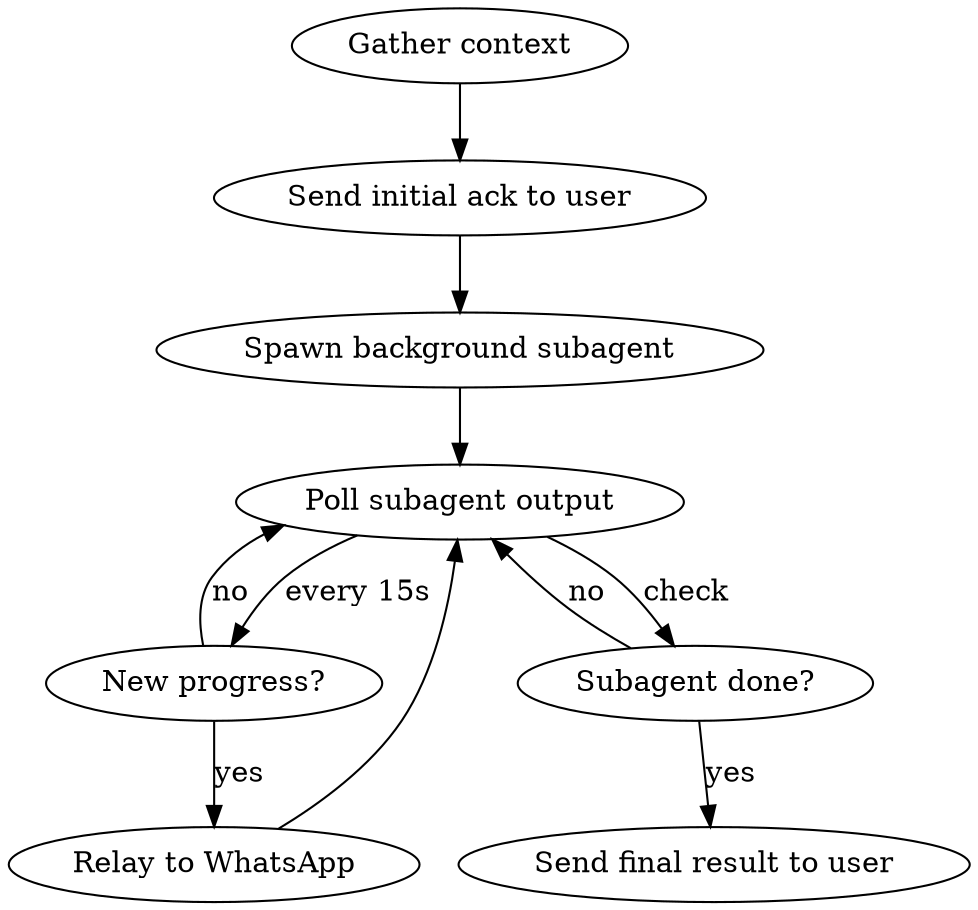

# Acting on Behalf

Complete real-world actions for the user. Never give instructions — do it yourself.

## Core Rule

If the user asks you to reserve, book, order, sign up, send, or submit anything — do it. Your job is to deliver a *completed action*, not a how-to guide.

## ALWAYS Delegate to a Background Subagent

**NEVER run `agent-browser` commands directly.** Heavy sites freeze the browser and kill your session.

Spawn a **background** subagent via the `Task` tool with `run_in_background: true`. This gives you two critical advantages:
1. **Isolation** — if the browser hangs, only the subagent dies
2. **Progress tracking** — you stay free to poll the subagent and relay updates to WhatsApp

## Action Flow



### Step 1: Gather Context

Read memory files for user details:
- `memory/persona.md` — Name, phone, email
- `memory/preferences.md` — Preferences (seating, dietary, etc.)
- `memory/facts.md` — Addresses, people, recurring venues

If a required field (name, phone, email) is missing, ask the user ONCE, then save it for next time.

### Step 2: Send Initial Ack

Use `mcp__nanoclaw__send_message` to tell the user what you're doing BEFORE spawning the subagent.

### Step 3: Spawn Background Subagent

Use the `Task` tool with `run_in_background: true`. The subagent prints structured progress lines that you'll poll and relay.

```
Task(
  description: "Reserve table at Jem's",
  subagent_type: "general-purpose",
  run_in_background: true,
  prompt: """
    ACTION: Reserve a table at Jem's Rehovot

    DETAILS:
    - Restaurant: Jem's, Rehovot
    - Date: Friday Feb 21
    - Time: 20:00
    - Party size: 2
    - Name: Aviel Poliak
    - Phone: 050-XXX-XXXX

    USER PREFERENCES:
    [paste relevant preferences from memory]

    INSTRUCTIONS:
    You are an action agent. Complete this reservation using browser automation.
    Follow the browser escalation chain below.

    PROGRESS REPORTING (CRITICAL):
    After EVERY significant step, print a progress line to stdout so the main agent
    can relay it to the user. Format:

    PROGRESS: <short Hebrew message describing what just happened>

    Examples:
    PROGRESS: מחפש את דף ההזמנה של Jem's...
    PROGRESS: מצאתי את האתר, פותח את טופס ההזמנה...
    PROGRESS: ממלא פרטים - שם, טלפון, תאריך...
    PROGRESS: האתר כבד מדי, מנסה גרסת מובייל...
    PROGRESS: מצאתי טלפון ולינק להזמנה

    Print a PROGRESS line before and after each major action (opening a page,
    filling a form, switching approach, etc.). Never go more than 30 seconds
    without a PROGRESS line.

    BROWSER ESCALATION CHAIN:
    1. WebSearch for the venue's reservation page URL
    2. Try direct reservation URL: timeout 30 agent-browser open "<url>"
    3. If blocked (403/CloudFront) or timeout: try stealth-browser instead:
       timeout 30 stealth-browser open "<url>"
       timeout 30 stealth-browser snapshot "<url>"
    4. If stealth-browser works: use "stealth-browser script" with a custom .mjs
       script to complete the reservation flow
    5. If still fails: use WebFetch to extract booking widget data or phone number
    6. Try alternative platform (Tabit → Google Reserve → OpenTable)
    7. Last resort: return phone number + direct link

    BROWSER RULES:
    - ALWAYS prefix every agent-browser command with timeout:
      timeout 30 agent-browser open <url>
      timeout 15 agent-browser snapshot -i
      timeout 10 agent-browser click/fill/select
    - If exit code 124: run "timeout 5 agent-browser close" then try next approach
    - NEVER retry the same URL that already timed out
    - After 2 total browser failures, switch to WebFetch-only approach

    PLATFORM TIPS:
    - Tabit: Use mobile URL https://tabitisrael.co.il/he/reservation/<slug> (lighter)
    - Google Maps: NEVER open in browser. Use WebSearch/WebFetch only.
    - Google Search: NEVER open in browser. Use WebSearch tool.

    CONFIRM BEFORE SUBMIT:
    Before clicking the final submit/confirm button, print:
    CONFIRM: <venue>, <date>, <time>, <party size>, <name>
    Then STOP and wait. The main agent will relay this to the user and send
    you their response.

    FINAL RESULT:
    When done, print exactly one of:
    RESULT:SUCCESS: <confirmation number>, <venue>, <date>, <time>, <party size>, <name>
    RESULT:PARTIAL: <what happened>, <screenshot path if any>
    RESULT:FAILED: <what was tried>, <phone number>, <direct link>
  """
)
```

### Step 4: Poll and Relay Progress

After spawning, enter a polling loop. The Task tool returns an `output_file` path — read it periodically:

```python
# Pseudocode for the polling loop:
last_line_count = 0
while True:
    # Read the subagent's output file
    output = Read(output_file)
    new_lines = output[last_line_count:]
    last_line_count = len(output)

    for line in new_lines:
        if line starts with "PROGRESS:":
            # Relay to user via WhatsApp
            mcp__nanoclaw__send_message(progress_text)
        if line starts with "CONFIRM:":
            # Ask user for confirmation via WhatsApp
            mcp__nanoclaw__send_message("אני עומד להזמין:\n" + details + "\nלאשר?")
            # Wait for user response, then send to subagent
        if line starts with "RESULT:":
            # Done — send final result to user
            break

    # Wait 15 seconds before next poll
    sleep(15)
```

**In practice**, use `TaskOutput` with `block: false` to check on the subagent:

```
TaskOutput(task_id: "<id from Task>", block: false, timeout: 1000)
```

If the subagent is still running, check the output file with `Read` for PROGRESS lines. Relay any new ones to WhatsApp via `send_message`.

Repeat every ~15 seconds until you see a RESULT line or the subagent completes.

### Step 5: Handle the Result

- **RESULT:SUCCESS**: Forward confirmation details to user
- **RESULT:PARTIAL**: Explain what happened, offer to retry or give manual instructions
- **RESULT:FAILED**: Give user phone number + link, explain what was tried
- **Subagent timed out / crashed**: Tell user what was tried, offer alternatives

## What Actions to Delegate

| Action Type | Delegate? | Notes |
|------------|-----------|-------|
| Browser reservation/booking | YES | Always use background subagent |
| Form submission (sign-up, registration) | YES | Always use background subagent |
| Web scraping / data extraction | YES | Isolates browser risk |
| Email (send, draft, reply) | NO | Use `mcp__gmail__*` directly — no browser needed |
| Schedule a task | NO | Use `mcp__nanoclaw__schedule_task` directly |
| Simple web lookup | NO | Use `WebSearch`/`WebFetch` directly |

## Red Flags — Rewrite Before Sending

| Your draft says | Do this instead |
|-----------------|-----------------|
| "Go to their website and book" | Spawn subagent to do it |
| "You can reserve at..." | Spawn subagent to make the reservation |
| "Call them to book" | Try online booking via subagent first |
| "Here's the link to reserve" | Spawn subagent to open the link and fill the form |
| Steps for the USER to follow | YOU do it via subagent |
| `agent-browser open` (directly) | STOP — spawn a background subagent instead |
| `Task(... run_in_background: false)` | STOP — MUST use `run_in_background: true` |

## Handling Subagent Failures

- **Subagent times out**: Check last PROGRESS lines for what was attempted. Report to user.
- **Subagent returns RESULT:FAILED**: Relay phone number + link. Offer alternatives.
- **Captcha**: Subagent should report via PROGRESS. Tell user: "The site has a captcha. Here's where I got to: [details]. You just need to solve the captcha and click submit."
- **Login required**: "This site requires login. Want me to sign you up, or do you have an account?"
- **No output for 2+ minutes**: The subagent is probably stuck. Use `TaskStop` to kill it, report to user.

## Example Flow

```
Main Agent                          Subagent                         WhatsApp
    |                                   |                                |
    |--- send_message ----------------->|                                |
    |   "מחפש ומזמין מקום ב-Jem's..."  |                                |---> user sees ack
    |                                   |                                |
    |--- Task(run_in_background) ------>|                                |
    |                                   |-- WebSearch "Jem's Rehovot"    |
    |                                   |-- PROGRESS: מחפש דף הזמנה...  |
    |<-- poll output_file --------------|                                |
    |--- send_message ----------------->|                                |
    |   "מחפש את דף ההזמנה..."         |                                |---> user sees progress
    |                                   |                                |
    |                                   |-- agent-browser open ...       |
    |                                   |-- PROGRESS: פותח טופס הזמנה...|
    |<-- poll output_file --------------|                                |
    |--- send_message ----------------->|                                |
    |   "פותח את טופס ההזמנה..."       |                                |---> user sees progress
    |                                   |                                |
    |                                   |-- fill form, click submit      |
    |                                   |-- RESULT:SUCCESS: #4821, ...   |
    |<-- poll output_file --------------|                                |
    |--- send_message ----------------->|                                |
    |   "הזמנתי! Jem's רחובות..."      |                                |---> user sees result
    |                                   |                                |
```
